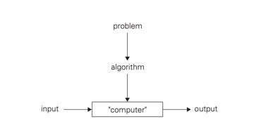
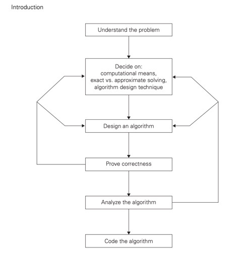
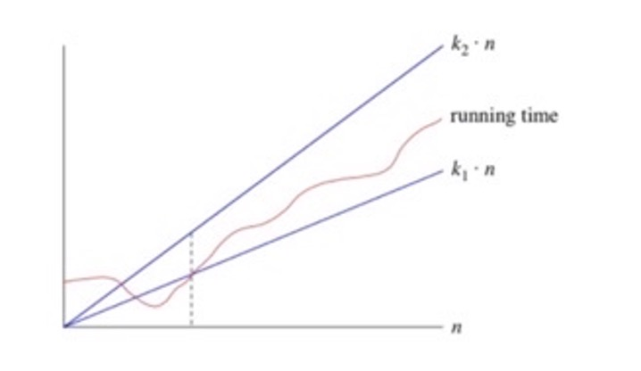
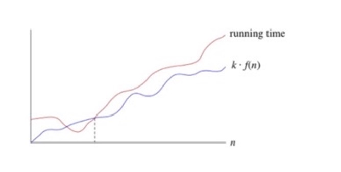
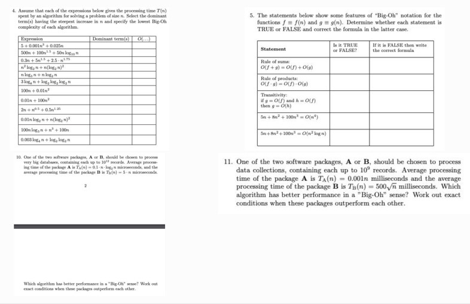
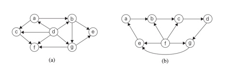

          
				   
				   
Week |        Tuesday        |        Thursday       | Percentage
---- | --------------------- | --------------------- | ----------
  -- | CRU  PFP  CDL  CAE    | CRU  PFP  CDL  CAE    |     --     
1    |  X    X    X    X     |  X    X    X    X     |    100     
2    |  X    X    X    X     |  X    X    X    X     |    100     
3    |  X    X    X    X     | NC    NC   NC   NC    |    100     
4    | GC    GC   GC   GC    | GC    GC   GC  GC     |    100       
5    |  X    X    X    X     |  X    X    X    X     |    100     
6    |  X    X    X    X     |  X    X    X    X     |    100       
7    | WD    WD   WD   WD    | GC    GC   GC   GC    |    100     
8    | NC    NC   NC   NC    | GC    GC   GC  GC     |    100       


                                            
 Claim Week | Grade Claim | Instructor Grade | Adjusted Grade 
 ----| ---- | ---- | ----|
4     |      B      |     B             |         B       
7-8    |     A       |                  |                
11-12    |             |                  |                


# Introduction

## Definition of an Algorithm 
a sequence of instructions for solving a problem with a specific outcome with any input.




### Euclid’s algorithm for computing gcd(m, n) pseudocode:
Euclid(m, n)
//Computes gcd(m, n) by Euclid’s algorithm
//Input: Two nonnegative, not-both-zero integers m and n
//Output: Greatest common divisor of m and n
while n = 0 do
r ← m mod n
m ← n
n ← r
return m

## steps to understanding the problem:



## Factorial code:
```python
	n = 23
	fact = 1
 
	for i in range(1, n+1):
    	fact = fact * i
 
	print("The factorial of 23 is : ", end="")
	print(fact)
```


# Analysis of Algorithm Efficiency

## Outline:
2.1- run time and algorithm speed

2.2- three notations: bigO, big omega, big theta

## Measuring an input’s size:
- Larger inputs mean longer run time in almost all algorithms. 
- Input size is the size of list 
- If input type is changing the size then assign “n” to size
- If input size is non changing (phone number) then input size is constant size
- Distinguish between worst-case, average case, and best case

## Units for Measuring Run Time:
- One approach: count number of function executions.
- Better approach: identify most important operation (basic operation) compute number of times basic operation is executed.  

## Binary search:
Divide half the portion of the list that could contain the item. Repeat this process to narrow down to one possible solution. log2n run time. 
### Pseudo code:
1. Let min = 0 and max = n-1.1.If max < min, then stop: target is not present in array. Return -1.
2. Compute guess as the average of max and min, rounded down (so that it is an integer).
3. If array[guess] equals target, then stop. You found it! Return guess.
4. If the guess was too low, that is, array[guess] < target, then set min = guess + 1.
5. Otherwise, the guess was too high. Set max = guess - 1.
6. Go back to step 2

### Python code:
``` python

def binary_search(item_list,item):
	first = 0
	last = len(item_list)-1
	found = False
	while( first<=last and not found):
		mid = (first + last)//2
		if item_list[mid] == item :
			found = True
		else:
			if item < item_list[mid]:
				last = mid - 1
			else:
				first = mid + 1	
	return found
	
print(binary_search([1,2,3,5,8], 6))
print(binary_search([1,2,3,5,8], 5)) 
```

## Big- θ (Big Theta) notation:
When we say that a particular running time is Θ(n), we're saying that once n gets large enough, the running time is at least k1*n and at most k2* n for some constants k1 and k2. Here's how to think of Θ(n)


 
## Big-O notation:
If a running time is O(f(n)), then for large enough n, the running time is at most k * f(n) for some constant k. Here's how to think of a running time that is O(f(n)):

.png)

## Big- Ω (Big-Omega) notation:
If a running time is Ω(f(n)), then for large enough n, the running time is at least k⋅f(n) for some constant k. Here's how to think of a running time that is Ω(f(n))



### If you have a function f(N):
Big-O tells you which functions grow at a rate >= than f(N), for large N
Big-Theta tells you which functions grow at the same rate as f(N), for large N
Big-Omega tells you which functions grow at a rate <= than f(N), for large N


## Group Assignment
``` python
        print("pivot: ", pivot, "index: ", pivot_index)
        print("target:", target)

import random

def _binary_search(array: list, target: int) -> int:
    print("length: ", len(array))
    pivot_index = int(len(array)/2)
    pivot = array[pivot_index]
    print("pivot: ", pivot, "index: ", pivot_index)
    print("target:", target)
    if target > pivot :
        new_array = array[pivot_index:len(array)]
        print("----Greater----")
        print("slice: ", new_array)
        return binary_search(new_array, target)
    elif target < pivot :
        new_array = array[0:pivot_index]
        print("----Lesser----")
        print("slice: ", new_array)
        return binary_search(new_array, target)
    else :
        print("only_pivot: ", pivot)
        return pivot

def binary_search(array: list, target: int) -> int :
    if  target > array[-1] :
        return False
    elif target < array[0] :
        return False
    elif len(array) == 0 :
        return False

list_min = random.randint(0, 10000)
list_max = random.randint(list_min, 10000)
my_list = []
for i in range(list_min, list_max) :
    my_list.append(i)

correct_ans = random.choice(my_list)

print("%%%%%%%%%%%%%%%%%%%%%%%%%%%%%%%%%%%%%%%%\n\n%%%%%%%%%%%%%%%%%%%%%%%%%%%%%%%%%%%%%%%%")
print(binary_search(my_list, correct_ans))
print("%%%%%%%%%%%%%%%%%%%%%%%%%%%%%%%%%%%%%%%%\n\n%%%%%%%%%%%%%%%%%%%%%%%%%%%%%%%%%%%%%%%%")

```

## asymptotic  notation  practice:

-1.1 Number 6, 12
	
a. Find gcd(31415, 14142) by applying Euclid’s algorithm.

``` python
def find_gcd(first, second)
	remainder = first%second

	while r:
    	first=second
    	second=remainder
    	remainder=first%second
	
	print('GCD is:', second)

find_gcd(31415, 14142)

#answer gcd = 1


```
 b. Estimate how many times faster it will be to find gcd(31415, 14142) by
Euclid’s algorithm compared with the algorithm based on checking consecutive ### integers from min{m, n} down to gcd(m, n). 
since the gcd between 31415, 14142 is it would take the consecutive checking 14142 iterations until it finally reaches the gcd. hoever with Euclid's algorithmn it only takes 11 steps meaning the Euclid's algorithimn can be estimated to run 1414 times faster than the consecutive checking approach. 

 12. Locker doors There are n lockers in a hallway, numbered sequentially from
1 to n. Initially, all the locker doors are closed. You make n passes by the
lockers, each time starting with locker #1. On the ith pass, i = 1, 2,...,n, you
toggle the door of every ith locker: if the door is closed, you open it; if it is
open, you close it. After the last pass, which locker doors are open and which
are closed? How many of them are open?

``` python


def get_lockers(lockers)
    N = len(lockers)
    count = 1
    for i in range(1, N):
        for times in range(i):
            if lockers[i] == 0:
            	lockers[i] = 1
            else:
                lockers[i] = 0
    return lockers

# 0 is closed, 1 is open
# all the lockers on square numbers will be open
# the number of times a locker is toggled is equal to its divisor.
get_lockers([0, 0, 0, 0, 0, 0, 0, 0, 0, 0])

```


-1.2 Number 1
A peasant finds himself on a riverbank with a wolf, a goat,
and a head of cabbage. He needs to transport all three to the other side of the
river in his boat. However, the boat has room for only the peasant himself
and one other item (either the wolf, the goat, or the cabbage). In his absence,
the wolf would eat the goat, and the goat would eat the cabbage. Solve this
problem for the peasant or prove it has no solution. (Note: The peasant is a
vegetarian but does not like cabbage and hence can eat neither the goat nor
the cabbage to help him solve the problem. And it goes without saying that
the wolf is a protected species.)

1. first take the goat to the other side of the river and leave the wolf and cabbage
2. go back to the riverbank and pick up the wolf and bring it to the otherside drop off the wolf and pick up the goat
3. bring the goat back to the riverbank and pick up the cabbage
4. take the cabbage to the other side of the river and leave it with the wolf
5. go back and pick up the goat and take it to the other side of the river.


-2.2 Number 1
1. Use the most appropriate notation among O, θ , and  Ω  to indicate the time
efficiency class of sequential search (see Section 2.1)
 a. in the worst case. O(n) 
 b. in the best case.   Ω(1)
 c. in the average case. θ(n) 


```python
def gcd(m,n):

	while r != 0:
		t= min{m, n}

		r = m % t

		if r == 0:
			r2 = n % t

			if r2 == 0:
			return t
		else:
			t = t -1
```

-1.2 Number 6

input Amount from customer keypad
read customer's details from accounts database
check if customer has insufficient funds
display a message to tell customer there is insufficient funds
if there are sufficient funds
display offer of available funds
input customer's response 
dispense cash Amount
            

-1.4 Number 2
If you have to solve the searching problem for a list of n numbers, how can you
take advantage of the fact that the list is known to be sorted? Give separate
answers for
a. lists represented as arrays.- if you know the list is sorted you can split the in half and continue to search with binary search and search more efficiently
b. lists represented as linked lists- if a list is sorted with a linked list you can use linear search.

-2.1 Numbers 4ab, 9a-f
4. a. Glove selection There are 22 gloves in a drawer: 5 pairs of red gloves, 4
pairs of yellow, and 2 pairs of green. You select the gloves in the dark and
can check them only after a selection has been made. What is the smallest
number of gloves you need to select to have at least one matching pair in
the best case? In the worst case? best case: 2 gloves. worst case: 22 gloves
b. Missing socks Imagine that after washing 5 distinct pairs of socks, you
discover that two socks are missing. Of course, you would like to have
the largest number of complete pairs remaining. Thus, you are left with
4 complete pairs in the best-case scenario and with 3 complete pairs in
the worst case. Assuming that the probability of disappearance for each
of the 10 socks is the same, find the probability of the best-case scenario;
the probability of the worst-case scenario; the number of pairs you should
expect in the average case. 
best case 1/9 worst case 8/9

9.
a. n(n + 1) and 2000n2 - higher
b. 100n^2 and 0.01n^3 - lower
c. log2 n and ln n -same
d. log2- same
2 n and log2 n2- lower
e. 2^n−1 and 2^n - lower
f. (n − 1)! and n! - lower

-2.2 2a-d
a. false
d. true


4. 
- O(n^3)
- O(n^1.5)
- O(n^1.75)
- O(n^2)
- O(log3n)
- O(log8n)
- O(n^2)
- O(n^2)
- O(n^1.25)
- O(log2n^2)
- O(n^3)
- O(log4n)
5.
- True
- True
- False g= O(f)
- False O(n^3)
- False O(n^3)
10. package b has a better preformance time because it is o(n) which has a better preformance compared to O(nlogn)

11. package B has a better preformance than the first pachage O(n)
-3.1 Numbers 3, 7, 8, 9
3. For each of the algorithms in Problems 4, 5, and 6 of Exercises 2.3, tell whether
or not the algorithm is based on the brute-force approach. 4) not brute force 5) not brute force 6) yes brute force

7. A stack of fake coins There are n stacks of n identical-looking coins. All of
the coins in one of these stacks are counterfeit, while all the coins in the other
stacks are genuine. Every genuine coin weighs 10 grams; every fake weighs
11 grams. You have an analytical scale that can determine the exact weight of
any number of coins.

a. Devise a brute-force algorithm to identify the stack with the fake coins and
determine its worst-case efficiency class.
b. What is the minimum number of weighings needed to identify the stack
with the fake coins?

seperate the stacks
weigh one coin from each stack 
whichever coin weighs 11 grams is cointerfit
minimum number of weighings would be 2 O(1)

8. Sort the list E, X, A, M, P , L, E in alphabetical order by selection sort.


-4.1 Number 1

-4.2 Number 1

Screen Shot Problems
4.


5. 
False - 
True
False
False
False

10. 
algorithm A - because the amount of data being processed is so large


11.
algorithm B n= 500sqrt(n)


## Selection Sort
Psuedocode:
1. Find the smallest card. Swap it with the first card.
2. Find the second-smallest card. Swap it with the second card.
3. Find the third-smallest card. Swap it with the third card.
4. Repeat finding the next-smallest card, and swapping it into the correct position until the array is sorted.

this algorithm is called selection sort because it repeatedly selects the next-smallest element and swaps it into place.

### Benefits of selection sort
-selection sort is simple
-it only requires n swaps
-it is good for real time applications
-it works well with small inputs

### cons of selection sort
-O(n^2) is slower than O(n log n) algorithms 
- insertion sort is faster than selection sort with small inputs


###Team Selection Sort example:
``` python
def selection_sort(List) :
    Min = List[0]
    Swap_Index = 0
    for N in range(len(List)) :
        Min = List[N]
        Swap_From_Index = N
        for I in range(Swap_Index, len(List)) :
            if List[I] < Min :
                Min = List[I]
                Swap_From_Index = I
            print("[I: ", I, "Min:", Min,"]",", ",end="")
        List[Swap_From_Index] = List[Swap_Index]
        List[Swap_Index] = Min
        print("\nList:" + str(List))
        Swap_Index += 1
    return List 
	```
###Team Insertion Sort example:
``` python

    for i in range(arr):
         
        key = arr[i]
 
        # Move elements of arr[0..i-1], that are
        # greater than key, to one position ahead
        # of their current position
        j = i-1
        while j >=0 and key < arr[j] :
                arr[j+1] = arr[j]
                j -= 1
        arr[j+1] = key
```
###Topological Sort example:
The topological sort algorithm takes a directed graph and returns an array of the nodes where each node appears before all the nodes it points to. The ordering of the nodes in the array is called a topological ordering.

```python 

from collections import defaultdict
class Graph:
    def __init__(self,n):
        self.graph = defaultdict(list)
        self.N = n
        
    def addEdge(self,u,v):
        self.graph[u].append(v)

    def sort(self,n,visited,stack):
        visited[n] = True
        for element in self.graph[n]:
            if visited[element] == False:
                self.sort(element,visited,stack)

            stack.insert(0,n)

    def topologicalSort(self):
        visited = [False]*self.N
        stack =[]

        for element in range(self.N):
            if visited[element] == False:
                self.sort(element,visited,stack)

        print(stack)

graph = Graph(6)
graph.addEdge(0,1)
graph.addEdge(0,2)
graph.addEdge(1,2)
graph.addEdge(2,3)
graph.addEdge(2,4)
graph.addEdge(3,4)

print("Topological Sort:  ")

graph.topologicalSort() 
```


# Brute Force + Exhaustive Search

## Brute force simple explanation:
Brute force algorithms is a method that of solving problems with trying every possibility rather than using techniques to inmprove efficancy.

### examples of brute force:
trying to guess a pad lock by trying every single number combo starting at 0000 then 0001 0002 0003....

Exhaustive search is simply a brute-force approach to combinatorial problems

the traveling salse man problem: 
a slase man needs to visit 10 cities across the country. brute force means to calculate the distance for every possible route not just the shortest or most efficiant one

## preformance of brute force:
the smaller the problem the more efficant brute force will be. you have a challenge of finding all the integers between 1 and 100,000,000 that are divisible by 511. If you take a simple approach, Brute Force algorithm would generate all the integers that are in the range. You can reduce the search criteria and make it more efficient by starting with 511 and repeatedly adding the same number until the number exceeds the given limit.

brute force can be done with trial and error, searching a number, sorting, or finding integers between a number

# Grade Claim 2 Problems 

## 3.1 Numbers 3, 7, 8, 9 

3.) For each of the algorithms in Problems 4, 5, and 6 of Exercises 2.3, tell whether
or not the algorithm is based on the brute-force approach.
-algorithm 4 is a brute force algorithm it is trying to find the mystery number by adding one each loop untill the number is found. 
-algorithm 5 is not a brute force algorithm because it is finding the mystery number by splitting the array in half
-algorithm 6 is a brute force method

7.)A stack of fake coins There are n stacks of n identical-looking coins. All of
the coins in one of these stacks are counterfeit, while all the coins in the other
stacks are genuine. Every genuine coin weighs 10 grams; every fake weighs
11 grams. You have an analytical scale that can determine the exact weight of
any number of coins.
a. Devise a brute-force algorithm to identify the stack with the fake coins and
determine its worst-case efficiency class.
1. choose the first coin to be a test coin
2. compare each coin to the first coin one by one on a scale.
3. when the scale is not balanced that means the fake coin has been found.

b. What is the minimum
time complaxity in O(n) n is the number of coins the min would be only pulling two coins with the second coin being the fake. 

8.) Sort the list E, X, A, M, P , L, E in alphabetical order by selection sort.

``` python 
def Selection(arr,n):
   
    # One by one move boundary of unsorted subarray
    for i in range(n):
        min_index = i
        min_str = arr[i]
         
        # Find the minimum element in unsorted subarray
        for j in range(i+1,n):
             
            # If min_str is greater than arr[j]
            if min_str>arr[j]:
                 
                # Make arr[j] as min_str and update min_index as j
                min_str = arr[j]
                min_index = j
                 
        # Swap the found minimum element with the first element      
        if min_index != i:
             
            # Store the first element in temp
            temp = arr[i]
             
            # Place the min element at the first position
            arr[i] = arr[min_index]

			# place the element in temp at min_index
            arr[min_index] = temp
      
    # Return the sorted array
    return arr
 
arr = ["E","X","A","M","P","L","E"]
 
print("Given array is")
for i in range(len(arr)):
    print(i,":",arr[i])
 
print("\nSorted array is")
for i in range(len(Selection(arr,len(arr)))):
    print(i,":",Selection(arr,len(arr))[i]) 
```
             
9.) Is selection sort stable? 
it is not stable because selection sort works by finding the minimum elements and iterting it in the right position by swapping.

## 4.1 Number 1 
1.) Ferrying soldiers A detachment of n soldiers must cross a wide and deep
river with no bridge in sight. They notice two 12-year-old boys playing in a
rowboat by the shore. The boat is so tiny, however, that it can only hold two
boys or one soldier. How can the soldiers get across the river and leave the
boys in joint possession of the boat? How many times need the boat pass from
shore to shore?
1. the boys row together across the river together, boy number one gets out 
2. boy number two rows back to the soilders and gets out of the boat. 
3. a soilder rows across the river to boy number one and gets out of the boat
4. boy number one rows back across the river to boy number two.
5. repeat steps 1-4 for every soilder 
it takes the amount of soilders * 4 to find the amount of times the boat goes shore to shore.

## 4.2 Number 1 
1.) Apply the DFS-based algorithm to solve the topological sorting problem for
the following digraphs:


stack          |  adj  |  S               |  pop                  
---------------|-------|------------------|-----
  _            |  _    |  a               |  _
  a            |  b    | a,b              |  _
 a, b          |  e    | a,b,e            |  _
 a,b,e         |  _    | a,b,e            |  e
 a,b           |  g    | a,b,e,g          |  _
 a,b,g         |  f    | a,b,e,g,f        |  _
 a,b,g,f       |  _    | a,b,e,g,f        |  f
 a,b,g         |  _    | a,b,e,g,f        |  g
 a,b           |  _    | a,b,e,g,f        |  b
 a             |  c    | a,b,e,g,f,c      |  _
 a,c           |  _    | a,b,e,g,f,c      |  c
 a             |  _    | a,b,e,g,f,c      |  a
 _             |  _    | a,b,e,g,f,c      |  d

 d -> a -> c -> b -> g -> f -> e

stack          |  adj  |  S               |  pop                  
---------------|-------|------------------|-----
  _            |  _    |  a               |  _
  a            |  b    | a,b              |  _
 a,b           |  c    | a,b,c            |  _
 a,b,c         |  d    | a,b,c,d          |  _
 a,b,c,d       |  g    | a,b,c,d,g        |  _
 a,b,c,d,g     |  e    | a,b,c,d,g,e      |  _
 a,b,c,d,g,e   |  _    | a,b,c,d,g,e      |  e
 a,b,c,d,g     |  _    | a,b,c,d,g,e      |  g
 a,b,c,d       |  _    | a,b,c,d,g,e      |  d
 a,b,c         |  _    | a,b,c,d,g,e      |  c
 a,b           |  _    | a,b,c,d,g,e      |  b
 a             |  _    | a,b,c,d,g,e      |  a
 _             |  _    | a,b,c,d,g,e      |  f

 f -> a -> b -> c -> d -> g -> e