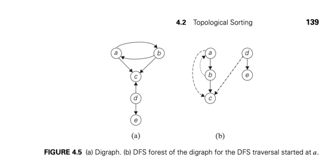
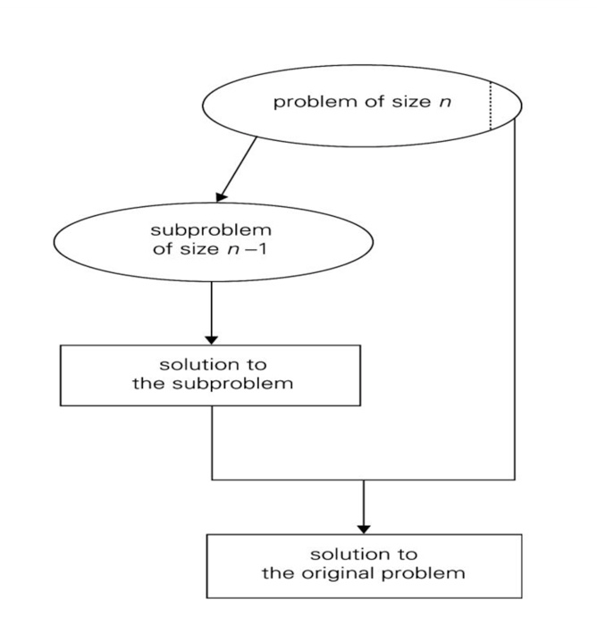

Week |        Tuesday        |        Thursday       | Percentage
---- | --------------------- | --------------------- | ----------
  -- | CRU  PFP  CDL  CAE    | CRU  PFP  CDL  CAE    |     --     
1    |  X    X    X    X     |  X    X    X    X     |    100     
2    |  X    X    X    X     |  X    X    X    X     |    100     
3    |  X    X    X    X     | NC    NC   NC   NC    |    100     
4    | GC    GC   GC   GC    | GC    GC   GC  GC     |    100       
5    |  X    X    X    X     |  X    X    X    X     |    100     
6    |  X    X    X    X     |  X    X    X    X     |    100       
7    | WD    WD   WD   WD    | GC    GC   GC   GC    |    100     
8    | NC    NC   NC   NC    | GC    GC   GC  GC     |    100  
9    |  X    X    X    X     |  X    X    X    X     |    100     
10   |  X    X    X    X     |  X    X    X    X     |    100  
11   | GC    GC   GC   GC    | GC    GC   GC  GC     |    100 

 Claim Week | Grade Claim | Instructor Grade | Adjusted Grade 
 ----| ---- | ---- | ----|
4     |      B      |     B             |         B       
7-8    |     A       |        A          |        A        
11    |     A        |                  |                


# Introduction

## Definition of an Algorithm 
a sequence of instructions for solving a problem with a specific outcome with any input.


### Euclid’s algorithm for computing gcd(m, n) pseudocode:
Euclid(m, n)
//Computes gcd(m, n) by Euclid’s algorithm
//Input: Two nonnegative, not-both-zero integers m and n
//Output: Greatest common divisor of m and n
while n = 0 do
r ← m mod n
m ← n
n ← r
return m

## steps to understanding the problem:


## Factorial code:
```python
	n = 23
	fact = 1
 
	for i in range(1, n+1):
    	fact = fact * i
 
	print("The factorial of 23 is : ", end="")
	print(fact)
```


# Analysis of Algorithm Efficiency

## Outline:
2.1- run time and algorithm speed

2.2- three notations: bigO, big omega, big theta

## Measuring an input’s size:
- Larger inputs mean longer run time in almost all algorithms. 
- Input size is the size of list 
- If input type is changing the size then assign “n” to size
- If input size is non changing (phone number) then input size is constant size
- Distinguish between worst-case, average case, and best case

## Units for Measuring Run Time:
- One approach: count number of function executions.
- Better approach: identify most important operation (basic operation) compute number of times basic operation is executed.  

## Binary search:
Divide half the portion of the list that could contain the item. Repeat this process to narrow down to one possible solution. log2n run time. 
### Pseudo code:
1. Let min = 0 and max = n-1.1.If max < min, then stop: target is not present in array. Return -1.
2. Compute guess as the average of max and min, rounded down (so that it is an integer).
3. If array[guess] equals target, then stop. You found it! Return guess.
4. If the guess was too low, that is, array[guess] < target, then set min = guess + 1.
5. Otherwise, the guess was too high. Set max = guess - 1.
6. Go back to step 2

### Python code:
``` python

def binary_search(item_list,item):
	first = 0
	last = len(item_list)-1
	found = False
	while( first<=last and not found):
		mid = (first + last)//2
		if item_list[mid] == item :
			found = True
		else:
			if item < item_list[mid]:
				last = mid - 1
			else:
				first = mid + 1	
	return found
	
print(binary_search([1,2,3,5,8], 6))
print(binary_search([1,2,3,5,8], 5)) 
```

## Big- θ (Big Theta) notation:
When we say that a particular running time is Θ(n), we're saying that once n gets large enough, the running time is at least k1*n and at most k2* n for some constants k1 and k2. Here's how to think of Θ(n)


 
## Big-O notation:
If a running time is O(f(n)), then for large enough n, the running time is at most k * f(n) for some constant k. Here's how to think of a running time that is O(f(n)):

.png)

## Big- Ω (Big-Omega) notation:
If a running time is Ω(f(n)), then for large enough n, the running time is at least k⋅f(n) for some constant k. Here's how to think of a running time that is Ω(f(n))


### If you have a function f(N):
Big-O tells you which functions grow at a rate >= than f(N), for large N
Big-Theta tells you which functions grow at the same rate as f(N), for large N
Big-Omega tells you which functions grow at a rate <= than f(N), for large N


## Group Assignment
``` python
        print("pivot: ", pivot, "index: ", pivot_index)
        print("target:", target)

import random

def _binary_search(array: list, target: int) -> int:
    print("length: ", len(array))
    pivot_index = int(len(array)/2)
    pivot = array[pivot_index]
    print("pivot: ", pivot, "index: ", pivot_index)
    print("target:", target)
    if target > pivot :
        new_array = array[pivot_index:len(array)]
        print("----Greater----")
        print("slice: ", new_array)
        return binary_search(new_array, target)
    elif target < pivot :
        new_array = array[0:pivot_index]
        print("----Lesser----")
        print("slice: ", new_array)
        return binary_search(new_array, target)
    else :
        print("only_pivot: ", pivot)
        return pivot

def binary_search(array: list, target: int) -> int :
    if  target > array[-1] :
        return False
    elif target < array[0] :
        return False
    elif len(array) == 0 :
        return False

list_min = random.randint(0, 10000)
list_max = random.randint(list_min, 10000)
my_list = []
for i in range(list_min, list_max) :
    my_list.append(i)

correct_ans = random.choice(my_list)

print("%%%%%%%%%%%%%%%%%%%%%%%%%%%%%%%%%%%%%%%%\n\n%%%%%%%%%%%%%%%%%%%%%%%%%%%%%%%%%%%%%%%%")
print(binary_search(my_list, correct_ans))
print("%%%%%%%%%%%%%%%%%%%%%%%%%%%%%%%%%%%%%%%%\n\n%%%%%%%%%%%%%%%%%%%%%%%%%%%%%%%%%%%%%%%%")

```
# Grade Claim 1 Problems
## asymptotic  notation  practice:

-1.1 Number 6, 12
	
a. Find gcd(31415, 14142) by applying Euclid’s algorithm.

``` python
def find_gcd(first, second)
	remainder = first%second

	while r:
    	first=second
    	second=remainder
    	remainder=first%second
	
	print('GCD is:', second)

find_gcd(31415, 14142)

#answer gcd = 1


```
 b. Estimate how many times faster it will be to find gcd(31415, 14142) by
Euclid’s algorithm compared with the algorithm based on checking consecutive ### integers from min{m, n} down to gcd(m, n). 
since the gcd between 31415, 14142 is it would take the consecutive checking 14142 iterations until it finally reaches the gcd. hoever with Euclid's algorithmn it only takes 11 steps meaning the Euclid's algorithimn can be estimated to run 1414 times faster than the consecutive checking approach. 

 12. Locker doors There are n lockers in a hallway, numbered sequentially from
1 to n. Initially, all the locker doors are closed. You make n passes by the
lockers, each time starting with locker #1. On the ith pass, i = 1, 2,...,n, you
toggle the door of every ith locker: if the door is closed, you open it; if it is
open, you close it. After the last pass, which locker doors are open and which
are closed? How many of them are open?

``` python


def get_lockers(lockers)
    N = len(lockers)
    count = 1
    for i in range(1, N):
        for times in range(i):
            if lockers[i] == 0:
            	lockers[i] = 1
            else:
                lockers[i] = 0
    return lockers

# 0 is closed, 1 is open
# all the lockers on square numbers will be open
# the number of times a locker is toggled is equal to its divisor.
get_lockers([0, 0, 0, 0, 0, 0, 0, 0, 0, 0])

```


-1.2 Number 1
A peasant finds himself on a riverbank with a wolf, a goat,
and a head of cabbage. He needs to transport all three to the other side of the
river in his boat. However, the boat has room for only the peasant himself
and one other item (either the wolf, the goat, or the cabbage). In his absence,
the wolf would eat the goat, and the goat would eat the cabbage. Solve this
problem for the peasant or prove it has no solution. (Note: The peasant is a
vegetarian but does not like cabbage and hence can eat neither the goat nor
the cabbage to help him solve the problem. And it goes without saying that
the wolf is a protected species.)

1. first take the goat to the other side of the river and leave the wolf and cabbage
2. go back to the riverbank and pick up the wolf and bring it to the otherside drop off the wolf and pick up the goat
3. bring the goat back to the riverbank and pick up the cabbage
4. take the cabbage to the other side of the river and leave it with the wolf
5. go back and pick up the goat and take it to the other side of the river.


-2.2 Number 1
1. Use the most appropriate notation among O, θ , and  Ω  to indicate the time
efficiency class of sequential search (see Section 2.1)
 a. in the worst case. O(n) 
 b. in the best case.   Ω(1)
 c. in the average case. θ(n) 


```python
def gcd(m,n):

	while r != 0:
		t= min{m, n}

		r = m % t

		if r == 0:
			r2 = n % t

			if r2 == 0:
			return t
		else:
			t = t -1
```

-1.2 Number 6

input Amount from customer keypad
read customer's details from accounts database
check if customer has insufficient funds
display a message to tell customer there is insufficient funds
if there are sufficient funds
display offer of available funds
input customer's response 
dispense cash Amount
            

-1.4 Number 2
If you have to solve the searching problem for a list of n numbers, how can you
take advantage of the fact that the list is known to be sorted? Give separate
answers for
a. lists represented as arrays.- if you know the list is sorted you can split the in half and continue to search with binary search and search more efficiently
b. lists represented as linked lists- if a list is sorted with a linked list you can use linear search.

-2.1 Numbers 4ab, 9a-f
4. a. Glove selection There are 22 gloves in a drawer: 5 pairs of red gloves, 4
pairs of yellow, and 2 pairs of green. You select the gloves in the dark and
can check them only after a selection has been made. What is the smallest
number of gloves you need to select to have at least one matching pair in
the best case? In the worst case? best case: 2 gloves. worst case: 22 gloves
b. Missing socks Imagine that after washing 5 distinct pairs of socks, you
discover that two socks are missing. Of course, you would like to have
the largest number of complete pairs remaining. Thus, you are left with
4 complete pairs in the best-case scenario and with 3 complete pairs in
the worst case. Assuming that the probability of disappearance for each
of the 10 socks is the same, find the probability of the best-case scenario;
the probability of the worst-case scenario; the number of pairs you should
expect in the average case. 
best case 1/9 worst case 8/9

9.
a. n(n + 1) and 2000n2 - higher
b. 100n^2 and 0.01n^3 - lower
c. log2 n and ln n -same
d. log2- same
2 n and log2 n2- lower
e. 2^n−1 and 2^n - lower
f. (n − 1)! and n! - lower

2.2 Number 1
1. Use the most appropriate notation among O, , and  to indicate the time
efficiency class of sequential search (see Section 2.1)
a. in the worst case.- O(n)
b. in the best case. - O(1)
c. in the average case - O(n)

-2.2 Number 2a-d
a. false
d. true


4. 
- O(n^3) - n^3
- O(n^1.5) -n^1.5
- O(n^1.75) -n^1.75
- O(n^2) -n^2
- O(log3n) - log3n
- O(log8n) - log8n
- O(n^2) - n^2
- O(n^2) -n^2 - n^2
- O(log2n^2) - log2n^2
- O(n^3) - n^3
- O(log4n) - log4n
5.
- False - O(f + g) ⊆ O(fg)
- False - O(f) * O(g) ⊆ O(f * g)
- False - g(n) = n^2 and h(n) = n. Then g = O(n^2) and h = O(n)
- True
- False -  O(n^4)
10. package b has a better preformance time because it is o(n) which has a better preformance compared to O(nlogn)

11. package B has a better preformance than the first pachage O(n)


# Brute Force + Exhaustive Search

## Brute force simple explanation:
Brute force algorithms is a method that of solving problems with trying every possibility rather than using techniques to inmprove efficancy.

### examples of brute force:
trying to guess a pad lock by trying every single number combo starting at 0000 then 0001 0002 0003....

Exhaustive search is simply a brute-force approach to combinatorial problems

the traveling salse man problem: 
a slase man needs to visit 10 cities across the country. brute force means to calculate the distance for every possible route not just the shortest or most efficiant one

## preformance of brute force:
the smaller the problem the more efficant brute force will be. you have a challenge of finding all the integers between 1 and 100,000,000 that are divisible by 511. If you take a simple approach, Brute Force algorithm would generate all the integers that are in the range. You can reduce the search criteria and make it more efficient by starting with 511 and repeatedly adding the same number until the number exceeds the given limit.

brute force can be done with trial and error, searching a number, sorting, or finding integers between a number

## Selection Sort
Psuedocode:
1. Find the smallest card. Swap it with the first card.
2. Find the second-smallest card. Swap it with the second card.
3. Find the third-smallest card. Swap it with the third card.
4. Repeat finding the next-smallest card, and swapping it into the correct position until the array is sorted.

this algorithm is called selection sort because it repeatedly selects the next-smallest element and swaps it into place.

### Benefits of selection sort
-selection sort is simple
-it only requires n swaps
-it is good for real time applications
-it works well with small inputs

### cons of selection sort
-O(n^2) is slower than O(n log n) algorithms 
- insertion sort is faster than selection sort with small inputs


### Team Selection Sort example:

``` python
def selection_sort(List) :
    Min = List[0]
    Swap_Index = 0
    for N in range(len(List)) :
        Min = List[N]
        Swap_From_Index = N
        for I in range(Swap_Index, len(List)) :
            if List[I] < Min :
                Min = List[I]
                Swap_From_Index = I
            print("[I: ", I, "Min:", Min,"]",", ",end="")
        List[Swap_From_Index] = List[Swap_Index]
        List[Swap_Index] = Min
        print("\nList:" + str(List))
        Swap_Index += 1
    return List 

arr = [7, 5, 3, 4, 1, 8, 6, 2]
print(selection_sort(arr))

```


### Team Insertion sort example:
``` python
def insertionSort(arr):
    #Split into sorted/unsorted
    #take first element of unsorted, move through sorted list to find it's spot
 
    l = len(arr)
 
    for i in range(l):
        check = arr[i]
 
       
        for j in range(i,l):
            if arr[j] < check:
                check = arr.pop(j)
                arr.insert(i,check)
        print(arr)
    return(arr)
 
arr = [7, 5, 3, 4, 1, 8, 6, 2]
 
print(insertionSort(arr))
```

# Grade Claim 2 Problems 

## 3.1 Numbers 3, 7, 8, 9 

3.) For each of the algorithms in Problems 4, 5, and 6 of Exercises 2.3, tell whether
or not the algorithm is based on the brute-force approach.
-algorithm 4 is a brute force algorithm it is trying to find the mystery number by adding one each loop untill the number is found. 
-algorithm 5 is not a brute force algorithm because it is finding the mystery number by splitting the array in half
-algorithm 6 is a brute force method

7.)A stack of fake coins There are n stacks of n identical-looking coins. All of
the coins in one of these stacks are counterfeit, while all the coins in the other
stacks are genuine. Every genuine coin weighs 10 grams; every fake weighs
11 grams. You have an analytical scale that can determine the exact weight of
any number of coins.
a. Devise a brute-force algorithm to identify the stack with the fake coins and
determine its worst-case efficiency class.
1. choose the first coin to be a test coin
2. compare each coin to the first coin one by one on a scale.
3. when the scale is not balanced that means the fake coin has been found.

b. What is the minimum
time complaxity in O(n) n is the number of coins the min would be only pulling two coins with the second coin being the fake. 

8.) Sort the list E, X, A, M, P , L, E in alphabetical order by selection sort.

``` python 
def Selection(arr,n):
    for i in range(n):
        min_index = i
        min_str = arr[i]
        
        for j in range(i+1,n):
            if min_str>arr[j]:
            
                min_str = arr[j]
                min_index = j   
        if min_index != i:
            temp = arr[i]
            arr[i] = arr[min_index]
            arr[min_index] = temp
    return arr
 
arr = ["E","X","A","M","P","L","E"]
 
for i in range(len(arr)):
    print(i,":",arr[i])
for i in range(len(Selection(arr,len(arr)))):
    print(i,":",Selection(arr,len(arr))[i]) 
```
             
9.) Is selection sort stable? 
it is not stable because selection sort works by finding the minimum elements and iterting it in the right position by swapping.

## 4.1 Number 1 
1.) Ferrying soldiers A detachment of n soldiers must cross a wide and deep
river with no bridge in sight. They notice two 12-year-old boys playing in a
rowboat by the shore. The boat is so tiny, however, that it can only hold two
boys or one soldier. How can the soldiers get across the river and leave the
boys in joint possession of the boat? How many times need the boat pass from
shore to shore?
1. the boys row together across the river together, boy number one gets out 
2. boy number two rows back to the soilders and gets out of the boat. 
3. a soilder rows across the river to boy number one and gets out of the boat
4. boy number one rows back across the river to boy number two.
5. repeat steps 1-4 for every soilder 
it takes the amount of soilders * 4 to find the amount of times the boat goes shore to shore.

## 4.2 Number 1 
1.) Apply the DFS-based algorithm to solve the topological sorting problem for
the following digraphs:


stack          |  adj  |  S               |  pop                  
---------------|-------|------------------|-----
  _            |  _    |  a               |  _
  a            |  b    | a,b              |  _
 a, b          |  e    | a,b,e            |  _
 a,b,e         |  _    | a,b,e            |  e
 a,b           |  g    | a,b,e,g          |  _
 a,b,g         |  f    | a,b,e,g,f        |  _
 a,b,g,f       |  _    | a,b,e,g,f        |  f
 a,b,g         |  _    | a,b,e,g,f        |  g
 a,b           |  _    | a,b,e,g,f        |  b
 a             |  c    | a,b,e,g,f,c      |  _
 a,c           |  _    | a,b,e,g,f,c      |  c
 a             |  _    | a,b,e,g,f,c      |  a
 _             |  _    | a,b,e,g,f,c      |  d

 d -> a -> c -> b -> g -> f -> e

stack          |  adj  |  S               |  pop                  
---------------|-------|------------------|-----
  _            |  _    |  a               |  _
  a            |  b    | a,b              |  _
 a,b           |  c    | a,b,c            |  _
 a,b,c         |  d    | a,b,c,d          |  _
 a,b,c,d       |  g    | a,b,c,d,g        |  _
 a,b,c,d,g     |  e    | a,b,c,d,g,e      |  _
 a,b,c,d,g,e   |  _    | a,b,c,d,g,e      |  e
 a,b,c,d,g     |  _    | a,b,c,d,g,e      |  g
 a,b,c,d       |  _    | a,b,c,d,g,e      |  d
 a,b,c         |  _    | a,b,c,d,g,e      |  c
 a,b           |  _    | a,b,c,d,g,e      |  b
 a             |  _    | a,b,c,d,g,e      |  a
 _             |  _    | a,b,c,d,g,e      |  f

 f -> a -> b -> c -> d -> g -> e


 # Decrease & Conquer: Decrease-by-one

 ## Decrease and Conquer technique
An algorithm strategy that exploites the relationship between a solution to a given instance of a problem and a solution to a smaller instance of the same problem. also known as incremental or inductive approach.

-Decrease or reduce problem instance to smaller instance of the same problem and extend solution.
-Conquer the problem by solving smaller instance of the problem.
-Extend solution of smaller instance to obtain solution to original problem. 

## Implementations of decrease and conquer
This approach can be either implemented as top-down(recursive implementation ) or bottom-up.Top-down approach(implemented in iterative way)

## Decrease by a constant 
the instance is reduced by the constant on each interation of the algorithm. the constant is usally equal to one but not nessecarily.


## Insertion Sort
it is similar to the way playing cards are sorted. the array is split into a sorted and unsorted part. values are sorted from the unsorted part into the sorted part, by placing cards at the right position.

-in the best case, insertion sort runs in O(n) time.
-worst case O(n2).

### Insertion Sort pseudo-code
To sort an array of size n in ascending order: 
1. Iterate from arr[1] to arr[n] over the array. 
2. Compare the current element (key) to its predecessor. 
3. If the key element is smaller than its predecessor, compare it to the elements before. Move the greater elements one position up to make space for the inserted/moved element.

## Insertion Sort code example:
``` python 
def insertionSort(arr):
    #Split into sorted/unsorted
    #take first element of unsorted, move through sorted list to find it's spot
 
    l = len(arr)
 
    for i in range(l):
        check = arr[i]
 
       
        for j in range(i,l):
            if arr[j] < check:
                check = arr.pop(j)
                arr.insert(i,check)
        print(arr)
    return(arr)
 
arr = [7, 5, 3, 4, 1, 8, 6, 2]
 
print(insertionSort(arr))
```

## Topological sorting process
use a temposrary stack for topological sort. use a recursive topological call for all the adjecentverticies and push them to the stack.
the last step is to print the contents of the stack. only push a vertex to the stack when the adjacentverticies are already in the stack



The topological sort algorithm takes a directed graph and returns an array of the nodes where each node appears before all the nodes it points to. The ordering of the nodes in the array is called a topological ordering.


1. Start at 5
2. “Visit neighbors” 5 -> 0
3. 0 has no neighbors so push to stack
4. Backtrack to 5
5. “Visit neighbors” 5 -> 2-> 3 -> 1
6. 1 has no neighbors so push to stack
7. Backtrack to 3
8. 3 has no neighbors so push to stack
9. Backtrack to 2
10. 2 has no neighbors to push to stack
11. Backtrack to 5
12. 5 has no neighbors to push to stack
13. Move to 4
14. “Visit neighbors” 4 ->
15. 4 has no neighbors to push to stack
452310

### Topological sorting code:
``` python

# Store edge information into a dictionary to show which vertices are connected
topo_vertices = {'a': ['d'], 'b': ['d'], 'c': ['e'], 'd': ['e'], 'e': []}

# Create a dictionary to show whether a vertex has been visited
visited = {'a': False, 'b': False, 'c': False, 'd': False, 'e': False}

# Create an empty list to store the sorted array
sorted_array = []

def topological_sort(v):
    #if a vertex is false switch it to true showing that it has been visited
    if visited[v] == False:
        visited[v] = True
        for key in topo_vertices[v]:
            #call the topological function recursively using the key value from the topo_verticies dictionary
            topological_sort(key)
        sorted_array.append(v)

#call the function for each key in the the visited dictionary
for key in visited:
    topological_sort(key)

print(sorted_array) 
```

# Decrease & Conquer: Decrease-by-constant +Variable size decrease
## Binary Search
Split a sorted array in half. use the half way mark as a key. If the value youre searching for is less than the item in the middle of the interval, only search the first half. Otherwise, search the second half. Repeatedly these steps until the value is found

The worst case time complexity of binary search is O(log n)

### Binary search Sort pseudo-code
1. Compare x with the middle element.
2. If x matches with the middle element, we return the mid index.
3. Else If x is greater than the mid element, then x can only lie in the right half subarray after the mid element. So we recur for the right half.
4. Else (x is smaller) recur for the left half.

## Russian Peasant Multiplication 
Russian peasant multiplication multiplies two whole numbers that uses a process of halving and doubling without using multiplication operator.

Time complexity of Russian Peasant Multiplication O(Log2b)

### Russian Peasant Multiplication Pseudocode
Let the two given numbers be 'a' and 'b'
1. Initialize result 'res' as 0.
2. Do following while 'b' is greater than 0   
- If 'b' is odd, add 'a' to 'res'   
- Double 'a' and halve 'b'
3. Return 'res'.

### Russian Peasant Multiplication code example:
``` python
#Let the two given numbers be 'a' and 'b'
def russian_peasant(a, b):
    #Initialize result 'res' as 0.
    res = 0
    while b > 0:
        #If 'b' is odd, add 'a' to 'res' 
        if b % 2 == 1:
            res += a
        #Double 'a' and halve 'b'
        a *= 2
        b //= 2
    return res

print(russian_peasant(192, 387))
```

# Divide & Conquer: mergesort, quicksort
This technique can be divided into the following three parts:
1. Divide: divide problem into smallersub-problems.
2. Conquer: Solve sub-problems with recursion.
3. Combine: Combine the sub-problems.

## Mergesort algorithm 
sort an array by dividing the input array into two halves, sort each of them recursively, and then merging the two smaller, sorted arrays into a single sorted one.

The time complexity for mergesort is: O(n log n) 

## Pseudocode for mergesort
- Declare left and right var which will mark the extreme indices of the array
- Left will be assigned to 0 and right will be assigned to n-1
- Find mid = (left+right)/2●Call mergeSort on (left,mid) and (mid+1,rear)
- Above will continue till left< right
- Then we will call merge on the 2 subproblems

### merge sort team example:
``` python
def mergesort(a):
    # get length of input list
    n = len(a)

    # create a base case to end the recursive call if there is only one element in the array
    if n == 1:
        return a

    # get the midpoint index of the array
    mid = len(a) // 2

    # split the array left and right
    L = a[:mid]
    R = a[mid:]

    # recursively call left and right halves
    mergesort(L)
    mergesort(R)

    # merge the two sorted halves back together
    a[:] = merge(L,R)
    return a

def merge(a,b):
    # create an empty list to store the merged array
    c = []

    while(len(a) != 0 and len(b) != 0):
        # if the first element of b is smaller, append it to the merged list and remove it from b
        if(a[0] > b[0]):
            c.append(b[0])
            del b[0]
        #else append the first element of a and remove it from a
        else:
            c.append(a[0])
            del a[0]

    # check to see if there are any remaining elements in a,
    while(len(a) > 0):
        #append the value to the sorted array
        c.append(a[0])
        del a[0]

    # check to see if there are any remaining elements in b
    while(len(b) > 0):
        #append the value to the sorted array
        c.append(b[0])
        del b[0]

    return c


arr = [7, 5, 3, 4, 1, 8, 6, 2]
print(mergesort(arr))

```


## Quicksort algorithm
 Quicksort is the opposite of merge sort. All the real work happens in the divide step. In fact, the combine step in quicksort does absolutely nothing.

 quicksort's worst-case running time is Θ(n^2)

 quicksort's best-case and average-case running time is the same as mergesort Θ(n lg n)

### Quicksort code example:
``` python
#input the unsorted array, the left most index, and the right most index
def quickSort(arr, left_index, right_index):
    #the left idex is index 0
    if left_index == None:
        left_index = 0
    #the right index is the last index of the array
    if right_index == None:
        right_index = (len(arr) - 1)

    #create an empty list to store the sorted array
    sorted_arr = []

    #if the left index is less than the right index 
    if left_index < right_index:
        #call the partition function as the pivot of the algorithm
        pivot = split(arr, left_index, right_index)
        #call quick sort recursivly in two sub arrays
        quickSort(arr, left_index, pivot - 1)
        quickSort(arr, pivot + 1, right_index)
    sorted_arr.append(arr)
    return sorted_arr

#this function chooses the pivot and splits the array into two parts. 
def split(arr, left_index, right_index):
    #to find the pivot use the last value of the array or subarray
    pivot = arr[right_index]
    i = left_index
    #use a for loop to iterate through each value of the arr by the index
    for j in range(left_index, right_index):
        #if a value is less than the pivot the first index value and the current index value switch places
        if arr[j] < pivot:
            arr[i], arr[j] = arr[j], arr[i]
            #the left index is incremented by one
            i += 1
    arr[i], arr[right_index] = arr[right_index], arr[i]
    return i


arr = [7, 5, 3, 4, 1, 8, 6, 2]

print(quickSort(arr, None, None))
```

# Problem Reduction
If you need to solve a problem but don’t know where to start, reduce it to another problem that you know how to solve

To prove that problem A is harder than problem B, reduce B to A.

When we reduce problem A to problem B, we are claiming that B is at least as complex as A



Transformation to a simpler or more convenient instance of the same problem—we call it instance simplification. Transformation to a different representation of the same instance—we call it representation change. Transformation to an instance of a different problem for which an algorithm is already available—we call it problem reduction.

### PulP Problem Reduction:
``` python
#minimize: Z = 3x + 5y
#subject to the constraints:
#2x + 3y >= 12
#-x + y <= 3
#x >= 4
#y <= 3
#x, y >= 0

#import the library pulp as p
import pulp as p

#create a LP min problem
Lp_prob = p.LpProblem('Problem', p.LpMinimize)

#create problem varibles
x = p.LpVariable("x", lowBound = 0) #create a variable x>= 0
y = p.LpVariable("y", lowBound = 0) #create a variable y>= 0

#objective function 
Lp_prob += 3 * x + 5 * y

#Constraints
Lp_prob += 2 * x + 3 * y >= 12
Lp_prob += -x + y <= 3
Lp_prob += x >= 4
Lp_prob += y <= 3

#if contradicting constraints are given, the program will use the last given restraint. if y >= 3 were specified, the program would just say y = 3

#display the problem
print(Lp_prob)

#solver
status = Lp_prob.solve()
#the solution status
print(p.LpStatus[status])

#print the final solution
print(p.value(x), p.value(y), p.value(Lp_prob.objective))

```

# Grade Claim 3 Problems

## 5.1 Number 1abcd
a. Write pseudocode for a divide-and-conquer algorithm for finding the position of the largest element in an array of n numbers.
1. difine an array a starting point and an ending point.
2. add a base case if the start point is the same as the end point return the start point and end the recursive call
3. create a mid point: mid = (start point + endpoint) /2
4. split the array in two parts: startpoint-mid and mid-endpoint
5. recursivly call the function twice
    -one call to find largest on the left with parameters array, startpoint, and midpoint
    -one call to find largest on the right with parameters array, mid+1, and endpoint
6. if the left has the largest int return the left else return the right side 

b. What will be your algorithm’s output for arrays with several elements of
the largest value? 
-the out put will be the largest value on the left side.

c. Set up and solve a recurrence relation for the number of key comparisons
made by your algorithm.
T(n) = 2T(n/2) + n/2

f(n) = n/2 = Θ(n^1)
n^logb(a) = n^log2(2) = n
a = 2, b = 2, and f(n) = n/2
*Master Theorem case 2
T(n) = Θ(n log n

d. How does this algorithm compare with the brute-force algorithm for this
problem? 
- the brute force algorithm for this function would take an array and iterate through each value of the array and compare each number together untill the largest is found one by one. However the divide and conqure algorithm splits the list in half each recursive call which makes it more efficient for large array inputs. brute force = O(n) divide and conqure = Θ(n log n)

## 5.1 Number 2abc
a. Write pseudocode for a divide-and-conquer algorithm for finding values of both the largest and smallest elements in an array of n numbers.
1. difine an array a starting point and an ending point.
2. add a base case if the start point is the same as the end point return the start point as both max and min value and end the recursive call
3. add another base case for if end == start + 1. return the min and max as the start and end for both left and right
3. create a mid point: mid = (start point + endpoint) /2
4. split the array in two parts: startpoint-mid and mid-endpoint
5. recursivly call the function twice
    -one call to find min and max on the left with parameters array, startpoint, and midpoint
    -one call to find min and max on the right with parameters array, mid+1, and endpoint
6. combine the results from the left and right halves

b. Set up and solve (for n = 2k) a recurrence relation for the number of key
comparisons made by your algorithm.
T(n) = 2T(n/2) + 2

 a = 2, b = 2, and f(n) = 2
*case 2 of the Master Theorem
f(n) = Θ(n) and a = b
T(n) = Θ(n log n)
c. How does this algorithm compare with the brute-force algorithm for this
problem? 
-same as the previous problem. brute force = O(n) divide and conqure = Θ(n log n). brute force is good for small array inputs divide and conqure is more efficient for large array inputs. 

## 5.2 Number 5ab
For the version of quicksort given in this section:
a. Are arrays made up of all equal elements the worst-case input, the bestcase input, or neither?
-same amount of elements are worst case senario. O(n^2)

b. Are strictly decreasing arrays the worst-case input, the best-case input, or
neither?
-decreasing arrays are the worst-case senario. O(n^2)

## 6.6 Number 1
a. Prove the equality
lcm(m, n) = m . n
gcd(m, n)
that underlies the algorithm for computing lcm(m, n).

m = p^a * x
n = p^b * y
gcd(m, n) = p^min(a,b) * z
lcm(m, n) = p^max(a,b) * w
m * n = p^(a+b) * x * y
gcd(m, n) * lcm(m, n) = p^(a+b) * z * w
lcm(m, n) = m * n / gcd(m, n)

b. Euclid’s algorithm is known to be in O(log n). If it is the algorithm that is
used for computing gcd(m, n), what is the efficiency of the algorithm for
computing lcm(m, n)?
O(log n)

## 6.6 Number 11
Jealous husbands There are n ≥ 2 married couples who need to cross a
river. They have a boat that can hold no more than two people at a time.
To complicate matters, all the husbands are jealous and will not agree on any
crossing procedure that would put a wife on the same bank of the river with
another woman’s husband without the wife’s husband being there too, even if
there are other people on the same bank. Can they cross the river under such
constraints?
a. Solve the problem for n = 2.
1. husband 1 crosses the river by himself
2. husband 2 crosses the river with their wife.
3. husband 1 returns to the original side with the boat.
4. wife 1 crosses the river by herself

b. Solve the problem for n = 3, which is the classical version of this problem.
1. wife 1 and wife 2 the river together
2. wife 1 goes to the original side with the boat
3. husband 3 and husband 1 cross the river together
4. wife 2 takes the boat back
5. husband 2 and husband 3 go across together.
6. wife 1 takes the boat back
7. wife 1 and wife 2 go across together

c. Does the problem have a solution for n ≥ 4? If it does, indicate how many
river crossings it will take; if it does not, explain why.
no solution. there is no way to geth the 4th couple across without a wife being left with another husband. 

