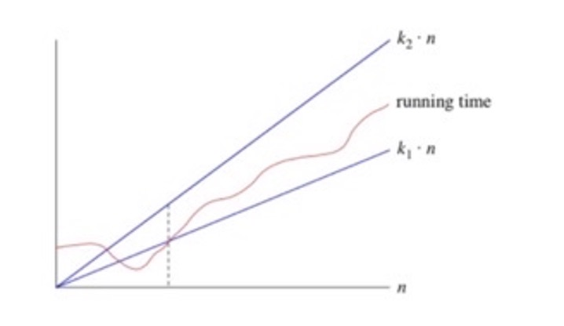
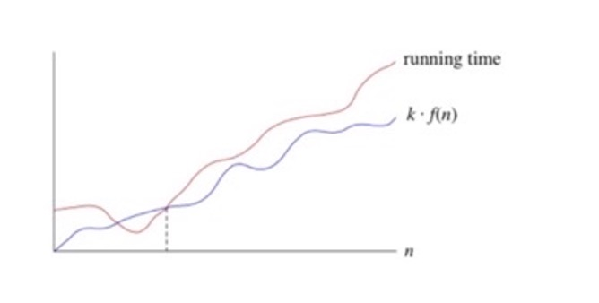

# Analysis of Algorithm Efficiency

## Outline:
2.1- run time and algorithm speed

2.2- three notations: bigO, big omega, big theta

## Measuring an input’s size:
- Larger inputs mean longer run time in almost all algorithms. 
- Input size is the size of list 
- If input type is changing the size then assign “n” to size
- If input size is non changing (phone number) then input size is constant size
- Distinguish between worst-case, average case, and best case

## Units for Measuring Run Time:
- One approach: count number of function executions.
- Better approach: identify most important operation (basic operation) compute number of times basic operation is executed.  

## Binary search:
Divide half the portion of the list that could contain the item. Repeat this process to narrow down to one possible solution. log2n run time. 
### Pseudo code:
1. Let min = 0 and max = n-1.1.If max < min, then stop: target is not present in array. Return -1.
2. Compute guess as the average of max and min, rounded down (so that it is an integer).
3. If array[guess] equals target, then stop. You found it! Return guess.
4. If the guess was too low, that is, array[guess] < target, then set min = guess + 1.
5. Otherwise, the guess was too high. Set max = guess - 1.
6. Go back to step 2

### Python code:
``` python

def binary_search(item_list,item):
	first = 0
	last = len(item_list)-1
	found = False
	while( first<=last and not found):
		mid = (first + last)//2
		if item_list[mid] == item :
			found = True
		else:
			if item < item_list[mid]:
				last = mid - 1
			else:
				first = mid + 1	
	return found
	
print(binary_search([1,2,3,5,8], 6))
print(binary_search([1,2,3,5,8], 5)) 
```

## Big- θ (Big Theta) notation:
When we say that a particular running time is Θ(n), we're saying that once n gets large enough, the running time is at least k1*n and at most k2* n for some constants k1 and k2. Here's how to think of Θ(n)


 
## Big-O notation:
If a running time is O(f(n)), then for large enough n, the running time is at most k * f(n) for some constant k. Here's how to think of a running time that is O(f(n)):

.jpg)

## Big- Ω (Big-Omega) notation:
If a running time is Ω(f(n)), then for large enough n, the running time is at least k⋅f(n) for some constant k. Here's how to think of a running time that is Ω(f(n))



### If you have a function f(N):
Big-O tells you which functions grow at a rate >= than f(N), for large N
Big-Theta tells you which functions grow at the same rate as f(N), for large N
Big-Omega tells you which functions grow at a rate <= than f(N), for large N


[5:39 PM] Deal, Jonah
        print("pivot: ", pivot, "index: ", pivot_index)
        print("target:", target)

[5:39 PM] Deal, Jonah
import random

def _binary_search(array: list, target: int) -> int:
    print("length: ", len(array))
    pivot_index = int(len(array)/2)
    pivot = array[pivot_index]
    print("pivot: ", pivot, "index: ", pivot_index)
    print("target:", target)
    if target > pivot :
        new_array = array[pivot_index:len(array)]
        print("----Greater----")
        print("slice: ", new_array)
        return binary_search(new_array, target)
    elif target < pivot :
        new_array = array[0:pivot_index]
        print("----Lesser----")
        print("slice: ", new_array)
        return binary_search(new_array, target)
    else :
        print("only_pivot: ", pivot)
        return pivot

def binary_search(array: list, target: int) -> int :
    if  target > array[-1] :
        return False
    elif target < array[0] :
        return False
    elif len(array) == 0 :
        return False

list_min = random.randint(0, 10000)
list_max = random.randint(list_min, 10000)
my_list = []
for i in range(list_min, list_max) :
    my_list.append(i)

correct_ans = random.choice(my_list)

print("%%%%%%%%%%%%%%%%%%%%%%%%%%%%%%%%%%%%%%%%\n\n%%%%%%%%%%%%%%%%%%%%%%%%%%%%%%%%%%%%%%%%")
print(binary_search(my_list, correct_ans))
print("%%%%%%%%%%%%%%%%%%%%%%%%%%%%%%%%%%%%%%%%\n\n%%%%%%%%%%%%%%%%%%%%%%%%%%%%%%%%%%%%%%%%")


